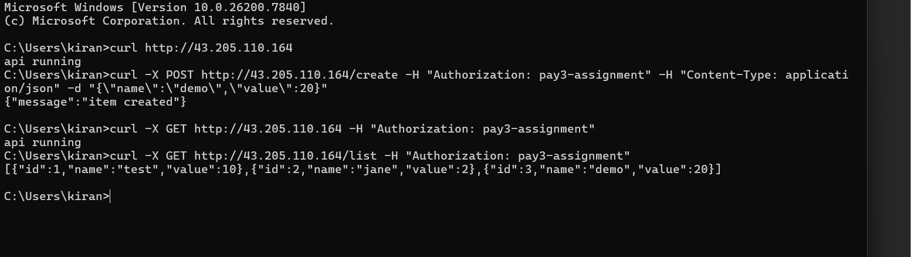

# DevOps Assignment 2 – AWS Compute, Networking & Database Integration

## Overview

This project implements a REST API using Flask, containerized with Docker, and deployed on AWS EC2. The application connects securely to an AWS RDS PostgreSQL instance.

Architecture:

User → EC2 (Docker Container) → RDS PostgreSQL (Private)


## Endpoints

1. GET /
   - Returns API status

2. POST /create
   - Creates a new item in the database
   - Requires header:
     Authorization: pay3-assignment

3. GET /list
   - Returns all items
   - Requires header:
     Authorization: pay3-assignment


## Environment Variables

The application reads database configuration from host environment variables.

Set the following variables on EC2:
```
export DB_HOST=<RDS_ENDPOINT>
export DB_PORT=5432
export DB_NAME=<DATABASE_NAME>
export DB_USER=<USERNAME>
export DB_PASSWORD=<PASSWORD>
```
These are dynamically injected into the container via docker-compose.


## Deployment Steps (On EC2)

1. Clone repository
```
git clone https://github.com/Kiran-347/Pay3-Dev-Ops-Assignment
cd Pay3-Dev-Ops-Assignment
```
2. Build and run container

`docker compose up -d --build`

3. Verify container

`docker ps`


## Public URL

`http://43.205.110.164`


## Example CURL Requests

### Check API

`curl http://43.205.110.164`


### Create Item
```
curl -X POST http://43.205.110.164/create \
-H "Authorization: pay3-assignment" \
-H "Content-Type: application/json" \
-d '{"name":"demo","value":10}'
```


### List Items
```
curl http://43.205.110.164/list \
-H "Authorization: pay3-assignment"
```


## Security Design

- RDS is not publicly accessible.
- RDS security group allows access only from EC2 security group.
- Database credentials are passed via environment variables.
- No secrets are committed to GitHub.


## Screenshots

### 1. Successful POST And GET Requests




### 2. RDS Table Showing Inserted Data

